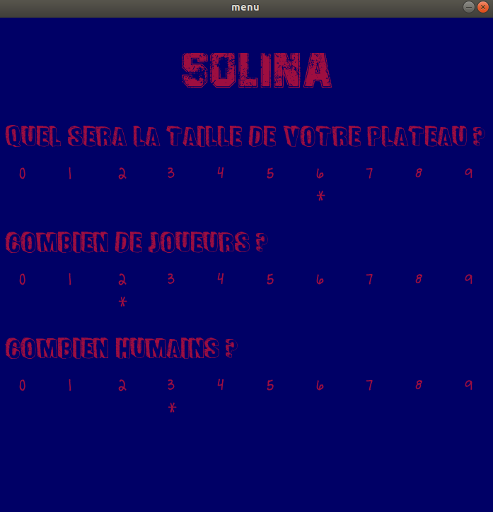
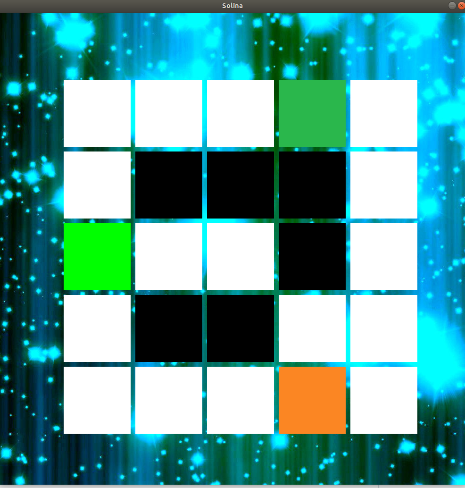

# Jeux de plateau Isola

Il s'agit d'un jeux tour par tour sur plateau où le but est d'isoler le joueur adverse. A chaque tour, les joueurs doivent se déplacer d'une case et rendre une case impraticable. Si un joueur ne peut plus bouger il a perdu.

## Choix du jeux

Dans le menu du jeux, il est possible de faire plusieurs choix (taille du plateau, nombre de joueur, nombre d'ordinateurs) permettant de faire varier l'expérience de jeux.

  

## Le plateau de jeux

A chaque tour le joueur peut faire déplacer son curseur (carré vert clair) avec les flèches pouis appuyer sur entré pour sélectionner une case particulière. Il y a 2 sélections à faire une première pour dire sur quelle case le joueur veut se déplacer et une autre pour bloquer une case du plateau.

  

Bon jeux !
